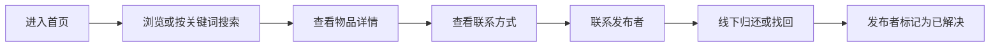
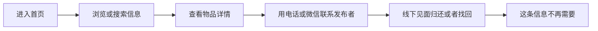
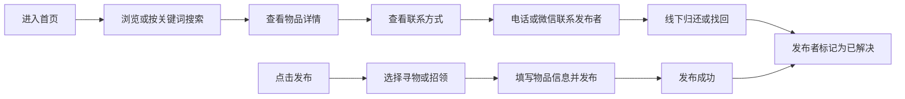

> 📌 **本文件是母版，用于统一修改正文**。发布时请使用 `博客园正文-成员A.md` / `博客园正文-成员B.md`，那两份只差抬头署名顺序和个人总结顺序。

# 第一次结对作业：校园失物招领小程序——需求分析与原型设计

{{HEADER}}
> **原型在线链接**：【部署后填写】

---

## 一、客户的困扰与主要用户

校园里丢东西是高频事件——校园卡、钥匙、水杯、雨伞、耳机、教材都很常见。大家现在习惯在班级群、宿舍群、朋友圈里发消息，但这套办法有三个绕不开的问题：**信息分散**（各群互不相通，教学楼里捡到校园卡的同学发了招领，失主未必看得到）、**容易被刷掉**（群消息更新太快，昨天发的寻物今天已经翻不到）、**没有统一搜索**（想找"校园卡"只能一条条翻聊天记录）。

主要用户有三类：**失主**要发布寻物、搜索是否有人拾到、联系拾主；**拾主**要发布招领、确认身份、联系失主；**浏览者**想随手看看有没有自己丢的东西。三类人的诉求可以归纳成一句话：**把信息集中起来，按物品名称就能搜到，并且能看出东西现在是什么状态。**

## 二、解决方案与主要功能

软件的核心思路是：**用"集中发布 + 关键词搜索 + 状态管理"替代分散的群消息。**

| 功能 | 说明 | 优先级 |
| --- | --- | --- |
| 浏览信息 | 首页按时间倒序展示，可切换全部 / 寻物 / 招领 | 必须 |
| 发布寻物 | 填写物品名称、分类、地点、时间、描述、联系方式 | 必须 |
| 发布招领 | 同上，字段语义变为"拾取地点 / 拾取时间" | 必须 |
| 搜索物品 | 按物品名称、分类、地点搜索，可加类型与时间筛选 | 必须 |
| 查看详情 | 展示物品图、描述、地点时间、联系人、联系方式 | 必须 |
| 修改状态 | 发布者可标记"已找到 / 已归还" | 必须 |
| 我的发布 | 管理自己发布过的信息 | 应该 |
| 收藏 | 详情页收藏，在"我的"里统一查看 | 可以 |

其中**"修改状态"是关键**：物品找到后标记为已解决，避免继续被同学打扰。

## 三、基本使用流程

> 发布流程与"三次讨论"的最终流程图见第五节。

## 四、原型设计

要求的四个页面（首页、发布信息页、搜索页、信息详情页）全部实现，另加"发布成功页"和"我的"，共 **6 个页面**。

【此处插入 6 张原型截图：首页、发布信息页、搜索页、信息详情页、发布成功页、我的】

主要设计考虑：

- **首页**：搜索框放在最显眼处，下方用“全部 / 寻物 / 招领”过滤；卡片用橙红、绿两种标签区分寻物与招领，**不点进详情也能判断是否和自己有关**。
- **发布信息页**：第一步先选“我丢了东西 / 我捡到东西”，决定后面填的是“丢失地点”还是“拾取地点”；必填项标红星。
- **搜索页**：输入关键词回车即出结果，另有热门搜索词与类型 / 时间筛选；无结果时给出空状态提示。
- **信息详情页**：联系方式中间四位打码，兼顾联系需要与隐私；底部固定“联系 TA”按钮。
- **我的**：分“我的发布 / 我的收藏”，每条信息可一键标记状态。

**关于原型工具**：本次使用 **HTML + CSS 手写的高保真交互原型**。好处是交互是**真的**——筛选、搜索、收藏、发布、状态修改都会真正改变数据；单文件，可直接用 GitHub Pages 生成在线链接。

## 五、结对过程

### 5.1 分工

我们采用**每个阶段一人主导、另一人评审**的方式结对，避免出现一边忙一边闲：

{{ROLES}}

### 5.2 三次讨论

**第一次讨论：先把问题说清楚**（9 月 24 日，图书馆，约 1 小时）

我们先把客户的三段描述逐句拆开，确认软件要解决的不是"再做一个聊天工具"，而是"让信息能集中、能被搜到、能看出状态"。这一轮把客户描述的过程直接画成了**第一版流程图**：

这一版的问题很明显：**只画了"看信息"这一条路**，发布信息、物品找到之后怎么办都没有体现；最后一步写的"信息不再需要"也太模糊，无法指导后面的设计。

**第二次讨论：各自的想法（出现了分歧）**（9 月 25 日，宿舍，约 1.5 小时）

这一轮两人站在不同角度，提出了几乎相反的意见：

- **吴怡霏的想法（偏功能完整）**：为了"联系更方便"和"找起来更准"，建议加入**站内即时聊天**（不用暴露手机号）和**地图标记丢失位置**（校园这么大，光写"三教 201"不够），再加**实名认证**保证信息可信。
- **薛锦荣的想法（偏简单可用）**：担心页面一多用户根本用不下去；本次作业的重点是原型设计，功能一旦膨胀，**第二次结对编程就做不完了**。主张把"联系发布者"简化为展示联系方式，地点用文字描述解决（如"第三教学楼 201"）。

**分歧的本质**：要不要为了"更好的体验"，牺牲"能做完、能被实现"。

**第三次讨论：定下最终流程与分工**（9 月 26 日，教室，约 1 小时）

两人各自对照作业要求后达成一致，做了四件事：

1. **砍掉**即时聊天、地图定位、实名认证——作业明确不要求，还会拖垮第二次结对编程；
2. "联系发布者"改为**详情页展示联系方式**（中间四位打码，兼顾联系与隐私），线下自行联系；
3. 补上第一版漏掉的**发布流程**和**物品找到后的状态处理**；
4. 确定 6 个页面与下面的**最终流程图**，并定下 5.1 的分工，约定所有产出必须经对方 Review 才能提交。

【此处插入 1—2 张结对讨论需求 / 画流程图时的照片或屏幕截图】

### 5.3 具体做了什么

{{WORK}}

## 六、PSP 表格

| 阶段 | 预估耗时 | 实际耗时 |
| --- | --- | --- |
| 需求分析 | 2h | 【】 |
| 流程图设计 | 1h | 【】 |
| 原型设计 | 4h | 【】 |
| 评审与修改 | 1h | 【】 |
| 博客撰写 | 2h | 【】 |
| 个人总结 | 0.5h | 【】 |
| **合计** | **10.5h** | 【】 |

## 七、个人总结

{{SUMMARY}}
