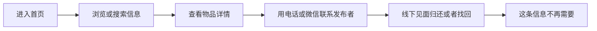
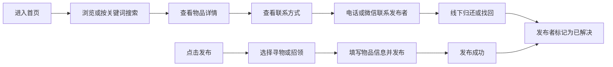

# 结对过程记录 · PSP · 个人总结

> 软件工程 · 第一次结对作业（校园失物招领小程序）
> 成员A：吴怡霏 102401206　　成员B：薛锦荣 102401213

---

## 一、团队分工

采用**每个阶段一人主导、另一人评审**的方式结对，所有产出必须经对方 Review 后才能提交。

| 阶段 | 主导 | 参与 / 评审 | 主要产出 | 预估 |
| --- | --- | --- | --- | --- |
| 1. 需求分析 | 吴怡霏 | 薛锦荣 | 4 条痛点、3 类用户、需求归纳 | 2h |
| 2. 功能清单与优先级 | 吴怡霏 | 薛锦荣 | 功能清单（8 条，分必须 / 应该 / 可以） | 1h |
| 3. 流程图设计 | 两人共同 | — | 第一版流程图 + 最终流程图 | 1h |
| 4. 原型设计（页面 / 交互） | 薛锦荣 | 吴怡霏 | 6 个页面、在线原型 | 4h |
| 5. 流程走查与测试 | 薛锦荣 | 吴怡霏 | 走查记录、修改清单 | 1h |
| 6. 在线部署 / 仓库维护 | 吴怡霏 | 薛锦荣 | GitHub 仓库、Pages 在线链接 | 0.5h |
| 7. 博客撰写 | 吴怡霏 起草 | 薛锦荣 校对 | 博客正文 | 2h |
| 8. PSP 与个人总结 | 各自 | 互审 | PSP 表 + 两段总结 | 0.5h |

**工作量小结**：吴怡霏 ≈ 6h，薛锦荣 ≈ 7h。

> 说明：**原型设计是本次作业的核心产出**（作业重点是"需求分析和原型设计"），由薛锦荣 主导，吴怡霏 从"需求覆盖度"角度走查。

**角色职责明细**

| 成员 | 角色 | 具体工作 |
| --- | --- | --- |
| 吴怡霏 102401206 | 项目经理 / 需求与文档 | 拆解客户困扰、整理用户角色与需求、列出功能清单与优先级、绘制流程图、维护 GitHub 仓库、撰写博客与 PSP 表 |
| 薛锦荣 102401213 | UI/UX 与原型、测试 | 设计页面结构与视觉规范（配色、标签、卡片布局）、用 HTML + CSS 制作 6 个页面的交互原型、截图、以普通用户视角逐条走查流程并提修改意见 |

---

## 二、结对过程记录

### 2.1 时间线

| 时间 | 事项 | 产出 |
| --- | --- | --- |
| 9 月 24 日 | 领题、拆解客户困扰 | 4 条痛点、3 类用户 |
| 9 月 24 日 | **第一次讨论**：梳理流程 | 第一版流程图 |
| 9 月 25 日 | 各自准备方案 | 两份各自的功能设想 |
| 9 月 25 日 | **第二次讨论**：交换想法、出现分歧 | 功能取舍清单 |
| 9 月 26 日 | **第三次讨论**：收敛方案 | 最终流程图、功能清单、分工表 |
| 9 月 26 日 | 原型制作与走查 | 6 个页面、修改清单 |
| 9 月 27 日 | 建仓库、开 Pages、写博客 | 在线链接、两份博客 |

### 2.2 第一次讨论：先把问题说清楚

**时间地点**：9 月 24 日，图书馆，约 1 小时

**做了什么**：把客户的三段描述逐句拆开，先确认软件要解决的核心问题不是"再做一个聊天工具"，而是三件事——**让信息能集中、能被搜到、能看出状态**。据此归纳出 4 条痛点和 3 类用户（失主、拾主、浏览者）。

**产出**：把客户描述的过程直接画成**第一版流程图**。

**发现的问题**：第一版只画了"看信息"这一条路，**发布信息、物品找到之后怎么办都没有体现**；最后一步写的"这条信息不再需要"太模糊，无法指导后面的页面设计。

### 2.3 第二次讨论：各自的想法

**时间地点**：9 月 25 日，宿舍，约 1.5 小时

两人各自准备了一版方案，结果提出了几乎相反的意见。

**吴怡霏的想法（偏功能完整）**

1. 建议加入**站内即时聊天**——失主和拾主可以直接在小程序里沟通，不用暴露手机号；
2. 建议加入**地图标记丢失位置**——校园范围很大，只写"第三教学楼 201"有时不好找；
3. 建议加入**实名认证**——保证信息可信，减少恶作剧。

**薛锦荣的想法（偏简单可用）**

1. 担心页面一多，用户根本用不下去；一个小程序要解决的是"找得到、联系得上"，不是"功能全"；
2. 本次作业的重点是**原型设计**，功能一旦膨胀，**第二次结对编程就做不完了**；
3. 主张把"联系发布者"简化为**详情页展示联系方式**，地点用**文字描述**解决（如"第三教学楼 201""第二食堂二楼"）。

**分歧的本质**：要不要为了"更好的体验"，牺牲"能做完、能被实现"。

### 2.4 第三次讨论：定下最终流程与分工

**时间地点**：9 月 26 日，教室，约 1 小时

两人各自对照作业要求后，达成四点一致：

1. **砍掉**即时聊天、地图定位、实名认证——作业明确不要求，还会拖垮第二次结对编程；
2. "联系发布者"改为**详情页展示联系方式**（中间四位打码，兼顾联系与隐私），线下自行联系；
3. **补上**第一版流程图漏掉的"发布流程"和"物品找到后的状态处理"；
4. 确定 6 个页面与最终流程图，并定下分工：**吴怡霏 负责需求分析与文档、仓库维护，薛锦荣 负责原型设计与测试**，约定所有产出必须经对方 Review 才能提交。

**最终流程图**

**最终功能清单**：浏览信息、发布寻物、发布招领、搜索物品、查看详情、修改状态（必须）；我的发布（应该）；收藏（可以）。

### 2.5 后续执行与走查

| 事项 | 负责人 | 结果 |
| --- | --- | --- |
| 页面结构与视觉规范 | 薛锦荣 | 主色蓝 `#2F6BFF`，寻物橙红 `#FF6B4A`，招领绿 `#0FA968` |
| 6 个页面原型实现 | 薛锦荣 | 首页、发布信息页、搜索页、信息详情页、发布成功页、我的 |
| 需求覆盖度走查 | 吴怡霏 | 确认 8 条功能全部有对应界面 |
| 用户视角走查 | 薛锦荣 | 提出 3 条修改意见（见下） |
| 三条基本流程验证 | 两人共同 | 查看信息→查看详情、搜索物品→查看结果、发布信息→发布成功，全部走通 |
| 仓库与在线链接 | 吴怡霏 | GitHub 仓库 + GitHub Pages 在线原型 |

**走查后修改的问题**

| 问题 | 修改方案 |
| --- | --- |
| 发布入口有两个（发布寻物 / 发布招领），用户得先想清楚点哪个 | 合并为一个入口，进入后第一步二选一 |
| 卡片上只写物品名称，判断不出是不是自己丢的 | 补上地点、时间和"寻物 / 招领"标签 |
| 配色过多，页面显得乱 | 收敛为蓝色主色 + 两种状态色 |

### 2.6 结对工作照片

【此处插入 1—2 张照片或截图，例如：】
【照片1：两人讨论需求 / 画流程图时的照片】
【照片2：GitHub Pull Request 页面截图（能同时看到两人的名字）】

---

## 三、PSP 表格

| 阶段 | 预估耗时 | 实际耗时 |
| --- | --- | --- |
| 需求分析 | 2h | 【】 |
| 流程图设计 | 1h | 【】 |
| 原型设计 | 4h | 【】 |
| 评审与修改 | 1h | 【】 |
| 博客撰写 | 2h | 【】 |
| 个人总结 | 0.5h | 【】 |
| **合计** | **10.5h** | 【】 |

> 填写提示：实际耗时按真实情况填，合计要与各项相加一致。如果某项明显超出预估，补一句原因反而是加分项（例如"原型工具不熟，比预估多花 1.5h"）。

---

## 四、两人个人总结（详细版）

> 博客正文中因字数限制做了精简，这里是完整版本。

### 吴怡霏 102401206

这次结对作业我主要承担需求分析和文档撰写。最大的收获是理解了"需求分析不等于把客户说的话抄一遍"：客户只说"群消息容易被刷掉，找起来不方便"，但我们要把它翻译成"集中发布 + 关键词搜索 + 状态管理"这样可设计、可实现的具体功能，还要明确写出**不做什么**——即时聊天和地图定位，是我们讨论后主动砍掉的。

遇到的问题主要有两个。一是刚开始功能列得太多，被同伴质疑"这个真的做得完吗"，才意识到范围控制的重要性；二是画第一版流程图时只画了"看信息"，把"发布"和"找到之后怎么办"漏掉了，直到第三次讨论补上后，流程才真正闭合。

另外这是我第一次完整地用 GitHub 来做协作：建仓库、加 Collaborator、开 Pages 生成在线链接。以前小组作业都是互相传文件，版本一多就分不清哪个是最新的，这次用分支和 PR，谁改了什么一目了然。

### 薛锦荣 102401213

我主要负责原型设计与页面走查。最大的感受是"能用"和"看起来清楚"是两回事：原型做出来之后我自己走了一遍，发现首页卡片如果只写物品名称，用户根本判断不出是不是自己丢的那个，于是补上了地点、时间和"寻物 / 招领"标签，用橙红和绿色区分——**不点进详情也能快速筛掉无关信息**，这是我觉得最有用的一处改动。

遇到的问题：一是最初把发布做成两个独立入口（发布寻物 / 发布招领），走查时发现要用户先想清楚点哪个，比较别扭，后来改成"一个入口、第一步二选一"；二是配色一开始用了很多种颜色，页面显得很乱，最后收敛到蓝色主色加两种状态色。

做原型的过程中我也第一次体会到"原型不是画得好看就行"：交互能不能走通、异常情况有没有反馈（比如搜索没有结果时要有空状态提示、发布时没填物品名称要提示），这些细节才是用户真正会遇到的。另外这次我也完整用了 GitHub 的分支和 PR 流程来协作，比互相传文件清楚很多。

---

## 五、提交前检查清单

- [ ] 博客开头已注明**两名同学**的学号和姓名
- [ ] 已填入**原型在线链接**（点开能正常访问）
- [ ] 已插入 6 张原型截图
- [ ] 已插入 1—2 张结对过程照片 / PR 截图
- [ ] PSP 表的**实际耗时**已填，合计正确
- [ ] **两份**个人总结都已改成自己的真实感受，内容不重复
- [ ] GitHub 仓库里能看到**两个人**的提交记录
- [ ] 两名同学**各自**提交了作业
