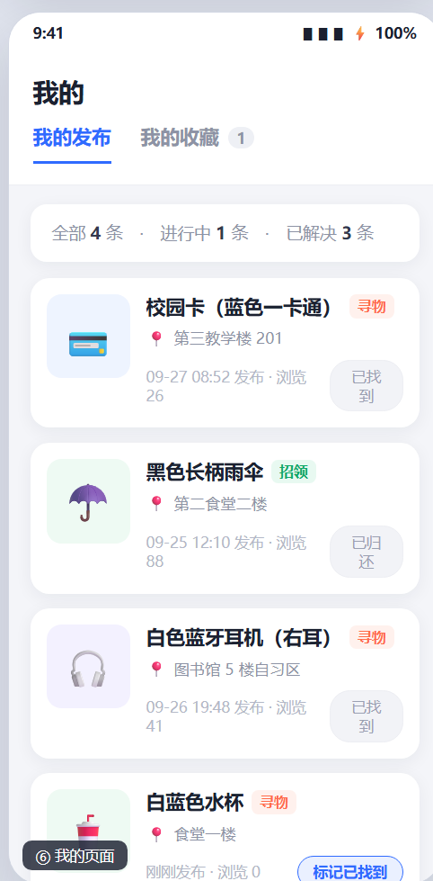
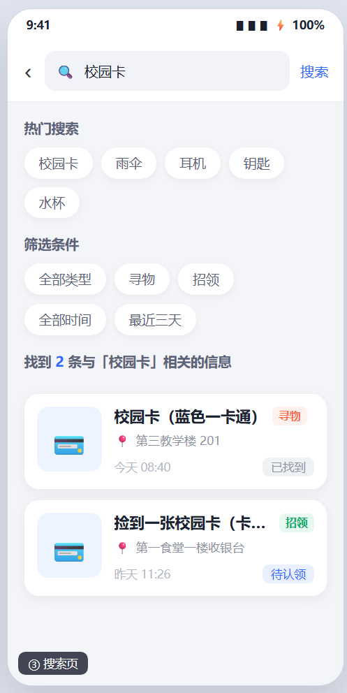
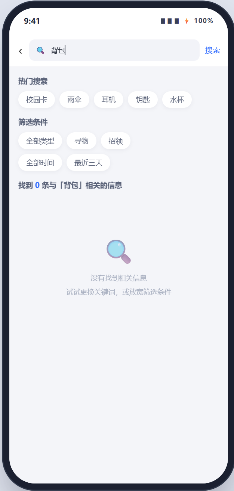
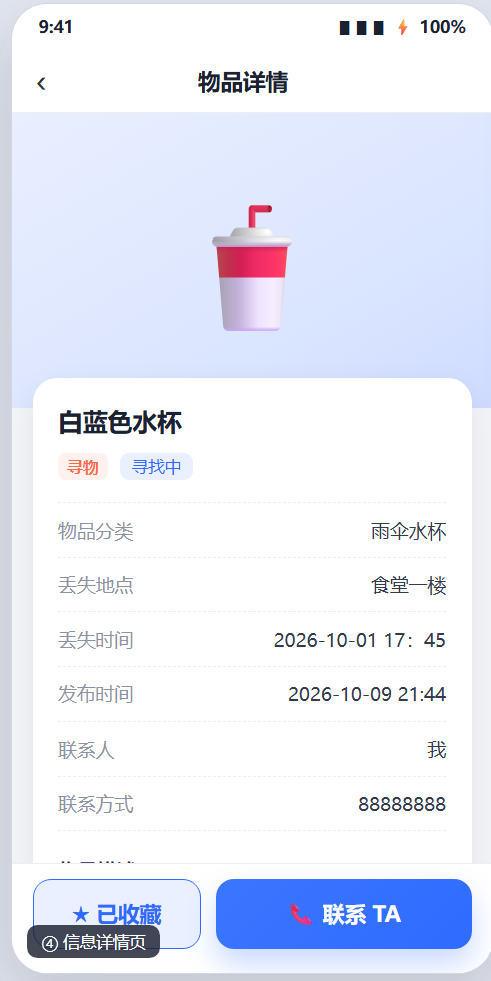
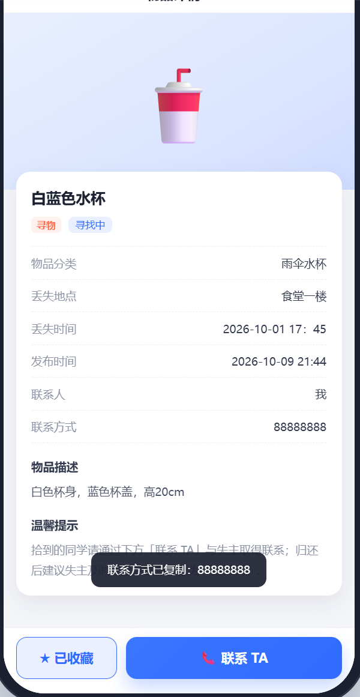
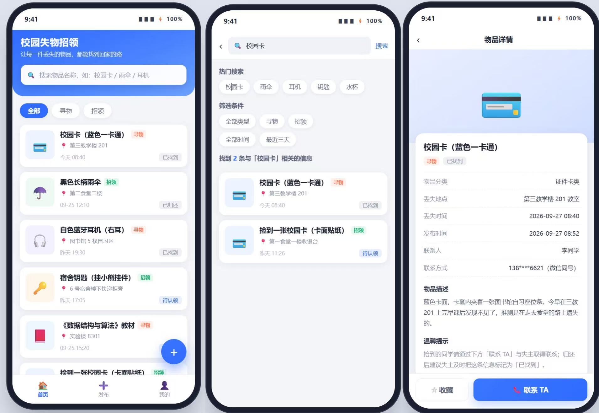

# Chrome 手工走查记录

## 测试环境

- 测试人：吴怡霏
- 日期与时间：2026年10月9日 21:50
- 操作系统：Windows
- Chrome 版本：154.0.4258.62 (正式版本) (64 位) 
- 页面来源：本地文件
- 测试数据如何清理：通过“我的”页面删除测试数据，或清除浏览器本地存储

## 测试记录

| 编号 | 操作与输入 | 预期结果 | 实际结果 | 结果（通过/失败/未测试） | 证据或问题链接 |
| --- | --- | --- | --- | --- | --- |
| 1 | 发布一条有效寻物信息（白蓝色水杯，食堂一楼，时间2026-10-01 17:45） | 创建成功，列表及“我的发布”可见 | 页面显示“发布成功”，在“我的发布”中能看到该条信息，状态为“寻找中” | 通过 |  |
| 2 | 搜索已知关键词（“校园卡”） | 显示匹配条目 | 搜索“校园卡”后，结果显示2条相关信息（包括“校园卡（蓝色一卡通）”和“捡到一张校园卡”），匹配准确 | 通过 |  |
| 5 | 搜索不存在的关键词 | 显示清楚的无结果状态 | 搜索“背包”显示“没有找到相关信息”|通过 |   |
| 6 | 从信息卡片打开详情（白蓝色水杯） | 详情字段和联系方式正确 | 详情页正确显示物品名称、分类、地点、时间、描述和联系方式（88888888） | 通过 | |
| 7 | 点击联系发布者 | 复制成功或提供可见回退信息 | 显示“已复制联系方式”|通过 |  |
| 8 | 分别结束寻物和招领信息 | 分别显示“已找到”和“已归还” | 首页中已存在“已找到”和“已归还”状态的测试数据，卡片状态展示正确 | 通过 |  |
| 9 | 从列表、搜索和详情查看已结束条目 | 各处状态一致 | 列表、搜索和详情均显示“已找到” | 通过 |  |
| 10 | 刷新页面 | 当前浏览器保存的数据按预期恢复 | 恢复 | 通过 |  |

## 缺陷与处理

本次走查未发现明显代码缺陷。在测试过程中，主要验证了发布、搜索和详情查看功能，数据能正常呈现。