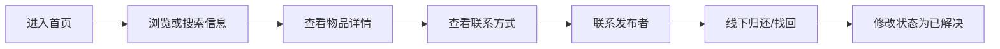
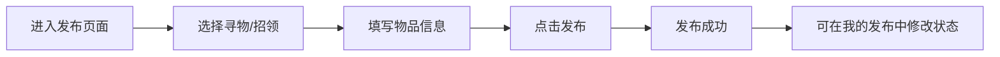
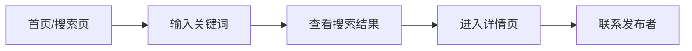

# 校园失物招领小程序——需求分析与原型设计技术文档

> 课程：软件工程  
> 作业：第一次结对作业  
> 成员A：吴怡霏 102401206  
> 成员B：薛锦荣 102401213  
> 日期：【202X-XX-XX】  
> 原型工具：墨刀 / Figma（建议墨刀）；同时交付 HTML 高保真交互原型  
> 原型在线链接：【部署后填写】  
> 原型文件：`prototype/index.html`（浏览器打开即可点击演示）

---

## 1. 项目概述

本项目面向校园学生，设计一个简单、清晰、易用的“校园失物招领小程序”。用户可以在小程序中集中发布寻物信息、招领信息，浏览和搜索失物/招领信息，并查看物品详情、联系发布者、修改信息状态。

本阶段只完成**需求分析、流程设计和原型设计**，不编写程序代码，不实现后台管理、实名认证、即时聊天、地图定位等复杂功能。设计目标是为第二次结对编程提供简单、明确、便于实现的页面与流程基础。

---

## 2. 问题背景与目标

校园中经常出现校园卡、钥匙、水杯、雨伞、耳机、书籍等物品遗失情况。目前信息主要发布在班级群、宿舍群、朋友圈中，存在以下问题：

1. 信息分散，不同群之间无法互通；
2. 群消息更新快，旧信息容易被覆盖；
3. 缺少统一搜索入口，查找困难；
4. 拾主与失主之间信息不对称，归还效率低。

本软件主要解决：**将校园寻物、招领信息集中展示，并支持关键词搜索和状态管理，提高失物找回与归还效率。**

---

## 3. 项目范围

### 3.1 本期要做

- 首页浏览失物/招领信息；
- 发布寻物信息；
- 发布招领信息；
- 按关键词搜索物品；
- 查看物品详情；
- 查看发布者联系方式；
- 修改信息状态，如“已找到/已归还”；
- “我的发布”简单管理。

### 3.2 本期不做

- 后台管理系统；
- 实名认证；
- 即时聊天；
- 地图定位；
- 复杂权限与审核；
- 支付、积分、评论等扩展功能。

---

## 4. 用户与需求分析

| 用户角色 | 典型场景    | 主要需求                 |
| ---- | ------- | -------------------- |
| 失主   | 校园卡丢失   | 发布寻物信息、搜索是否有人拾到、联系拾主 |
| 拾主   | 捡到钥匙/水杯 | 发布招领信息、查看是否有人寻找、联系失主 |
| 浏览者  | 路过查看    | 浏览列表、搜索物品、查看详情       |
| 发布者  | 已找回/已归还 | 修改状态、避免继续被打扰         |

核心需求可归纳为：**发布、浏览、搜索、查看详情、联系、状态修改。**

---

## 5. 功能需求

| 编号    | 功能     | 说明                    | 优先级 |
| ----- | ------ | --------------------- | --- |
| FR-01 | 首页浏览   | 展示寻物/招领列表，支持切换类型      | 必须  |
| FR-02 | 发布寻物   | 填写物品名称、地点、时间、描述、联系方式  | 必须  |
| FR-03 | 发布招领   | 填写拾到物品信息、地点、时间、联系方式   | 必须  |
| FR-04 | 搜索物品   | 按关键词搜索，如“校园卡”“耳机”     | 必须  |
| FR-05 | 查看详情   | 展示图片、描述、地点、时间、状态、联系方式 | 必须  |
| FR-06 | 修改状态   | 发布者可标记“已找到/已归还”       | 必须  |
| FR-07 | 我的发布   | 查看自己发布的信息并管理          | 应该  |
| FR-08 | 发布成功提示 | 发布后给出明确反馈             | 必须  |

---

## 6. 原型设计

### 6.1 页面清单

原型共 6 个页面，完整覆盖作业要求的三条基本演示流程。

| 序号 | 页面 | 主要元素 | 可跳转到 |
| --- | --- | --- | --- |
| ① | 首页 | 标题、搜索框、全部/寻物/招领切换、信息卡片列表、悬浮发布按钮 | 搜索页、详情页、发布页 |
| ② | 发布信息页 | 寻物/招领选择、物品名称、分类、地点、时间、描述、图片、联系方式、立即发布 | 发布成功页 |
| ③ | 搜索页 | 关键词输入、热门搜索、类型/时间筛选、搜索结果列表 | 详情页、首页 |
| ④ | 信息详情页 | 物品大图、名称、类型与状态标签、分类/地点/时间/联系人/联系方式、描述、底部「收藏 / 联系 TA」 | 返回首页 |
| ⑤ | 发布成功页 | 成功图标、结果说明、查看详情 / 去我的发布 | 详情页、我的发布页 |
| ⑥ | 我的（发布 / 收藏） | 发布统计、我的信息列表、标记「已找到 / 已解决」、收藏列表 | 详情页、首页 |

### 6.2 关键页面设计说明

- **首页**：顶部蓝色渐变头图建立视觉焦点，搜索框是页面上最显眼的控件；下方的「全部 / 寻物 / 招领」标签可即时过滤列表；信息卡片用颜色区分「寻物（橙红）」与「招领（绿）」，不点进详情也能判断是否与自己相关；右下角悬浮「＋」保证任意滚动位置都能一键发布。
- **发布信息页**：进入页面第一件事就是选择「我丢了东西 / 我捡到东西」，它决定后续字段语义（填写丢失地点还是拾取地点）；带红色星号的字段为必填，降低无效信息比例。
- **搜索页**：由首页搜索框点击进入，输入关键词后回车（或点「搜索」）即过滤出结果；下方提供热门搜索（点一下直接搜）与类型 / 时间筛选，减少用户打字成本；结果区显示「找到 N 条」并复用列表卡片，无结果时给出空状态提示。
- **信息详情页**：上方大图 + 标题 + 类型/状态标签，中间以键值对列出分类、地点、时间、联系人；联系方式中间四位打码，兼顾联系需要与隐私保护；底部固定操作条保证「联系 TA」始终可见。
- **发布成功页**：给出明确的成功反馈，并提供两个清晰的下一步，避免用户发布后不知所措。
- **我的（发布 / 收藏）**：上方分「我的发布 / 我的收藏」两个标签，发布页展示「全部 / 进行中 / 已解决」的数量统计；每条信息右侧提供「标记已找到 / 已归还」按钮，找到物品后可一键更新状态，避免继续被联系打扰；收藏页汇总详情页中点过「☆ 收藏」的信息，标签上带数量角标。

### 6.3 界面设计规范

| 项目 | 取值 |
| --- | --- |
| 主色 | `#2F6BFF` 品牌蓝，用于主要按钮与选中态 |
| 寻物标签 | 橙红 `#FF6B4A` |
| 招领标签 | 绿色 `#0FA968` |
| 页面背景 | `#F4F5F9`，卡片白色，圆角 14px |
| 字号 | 标题 16–20px，正文 12.5–14.5px |
| 图标 | 前期用 emoji 占位，实现时可替换为图标字体 |

### 6.4 交互演示路径

原型为单文件 HTML，浏览器打开 `prototype/index.html` 即可点击演示。原型内置 7 条示例数据，**下列操作均为真实交互**，会真正改变列表内容与状态：

1. **查看信息 → 查看详情**：首页点击任意卡片进入详情页，点左上角「‹」返回原页面；
2. **搜索物品 → 查看搜索结果**：首页点击搜索框 → 搜索页 → 输入关键词后回车（或点「搜索」）→ 结果实时更新；也可点击热门搜索词，或切换类型 / 时间筛选；
3. **分类浏览**：首页点击「全部 / 寻物 / 招领」，列表按类型过滤；
4. **发布信息 → 发布成功**：首页「＋」或底部「发布」→ 选择寻物 / 招领并填写表单 → 立即发布 → 成功页；新信息会同时出现在首页和「我的发布」中；
5. **状态管理**：「我的 → 我的发布」中点击「标记已找到 / 已归还」，状态与统计即时更新，首页列表同步变化；
6. **收藏**：详情页点击「☆ 收藏」，可在「我的 → 我的收藏」中查看，标签上带数量角标；
7. 点击右上角「全部页面平铺」，可一次性查看全部 6 个页面，方便截图。

---

## 7. 核心使用流程

### 7.1 浏览与联系流程

### 7.2 发布流程

### 7.3 搜索流程

---

## 8. 原型工具、链接与交付物

### 8.1 工具选型

| 工具 | 说明 |
| --- | --- |
| **墨刀**（推荐） | 中文界面、内置小程序画布、可一键生成分享链接和二维码，最贴合本作业要求 |
| Figma | 自由度高，适合有设计基础的同学 |
| HTML + CSS | 本仓库采用的方式，交互真实、便于版本管理与在线部署 |

### 8.2 本仓库交付的原型

- 文件：`prototype/index.html`，单文件、无外部依赖；
- 打开方式：双击用浏览器打开，或在该目录执行 `python -m http.server` 后访问；
- 特点：6 个页面可真实点击跳转；点击不同卡片进入不同物品的详情；分类筛选、关键词搜索、收藏、发布、状态修改均为真实交互；内置「全部页面平铺」截图模式。

### 8.3 生成在线链接的两种方式

1. **HTML 原型上线**：把 `prototype/index.html` 推送到 GitHub 仓库，在 Settings → Pages 中选择 main 分支根目录，即可得到 `https://<用户名>.github.io/campus-lost-and-found/prototype/` 形式的在线链接。
2. **墨刀复刻**：按 6.1—6.3 的页面清单与设计规范在墨刀中重绘，点击「分享」获取在线链接与二维码。

> 建议两者都做：墨刀链接用于提交作业，HTML 原型用于第二次结对编程时对照实现。

### 8.4 博客配图清单

首页、发布信息页、搜索页、信息详情页、发布成功页、我的发布页共 6 张原型截图，另加 1—2 张结对讨论照片（对应要求 11）。

---

## 9. 团队分工与协作流程

两人结对，采用“主责 + 协作 + 交叉评审”的软件工程团队思想。每阶段一人主导，另一人评审，关键产物双方共同确认。

| 成员        | 角色                   | 主要职责                                        |
| --------- | -------------------- | ------------------------------------------- |
| 成员A 吴怡霏 102401206 | 项目经理 / 需求负责人 / 文档负责人 | 拆解客户困扰、用户需求分析、功能清单、流程图、博客撰写、PSP |
| 成员B 薛锦荣 102401213 | UI/UX 与原型负责人 / 测试负责人 | 原型工具选型、页面设计、交互实现、截图、可用性走查、流程验证、GitHub 仓库搭建与在线部署              |
| 共同        | 评审与测试                | 需求评审、原型评审、三条基本流程演示、博客互审、个人总结                |

结对机制：

- 需求阶段：A 主导，B 以“用户视角”质询；
- 原型阶段：B 主导，A 以“需求覆盖度”走查；
- 测试阶段：两人分别扮演失主、拾主，走通“浏览→详情”“发布→成功”“搜索→结果”；
- 文档阶段：A 整合，B 校对；
- 所有产出必须经过另一人 Review 后才能提交。

---

## 10. 项目里程碑与交付物

| 阶段   | 主要任务             | 产出           |
| ---- | ---------------- | ------------ |
| 启动   | 建 GitHub 仓库、确定工具 | README、分工表   |
| 需求分析 | 用户分析、功能清单、流程图    | 需求文档、流程图     |
| 原型设计 | 低保真到高保真页面        | 在线原型、截图      |
| 评审测试 | 走查三条流程           | 评审记录、修改版原型   |
| 文档博客 | 写博客、PSP、总结       | 博客园 Markdown |
| 提交   | 检查链接、字数、截图       | 最终作业         |

---

## 11. GitHub 协作规范

- 仓库名：`campus-lost-and-found`
- 分支：`main`、`dev`、`feature-*`
- Issue：记录“需求分析”“首页原型”“发布页原型”“博客撰写”等任务；
- Pull Request：每次修改由另一人 Review 后合并；
- 提交信息：如 `docs: 完成需求分析`、`proto: 完成首页原型`；
- 目录建议：
  - `docs/`：需求文档、流程图；
  - `prototype/`：原型截图、导出文件；
  - `blog/`：博客 Markdown；
  - `README.md`：项目说明。

---

## 12. PSP 表格模板

| 阶段    | 预估耗时  | 实际耗时 |
| ----- | -----:| ----:|
| 需求分析  | 2h    | 【】   |
| 流程图设计 | 1h    | 【】   |
| 原型设计  | 4h    | 【】   |
| 评审与修改 | 1h    | 【】   |
| 博客撰写  | 2h    | 【】   |
| 个人总结  | 0.5h  | 【】   |
| 合计    | 10.5h | 【】   |

---

## 13. 风险与应对

| 风险      | 应对                   |
| ------- | -------------------- |
| 原型工具不熟  | 先用低保真，再逐步美化          |
| 需求膨胀    | 严格围绕“发布、浏览、搜索、详情、状态” |
| 在线链接失效  | 导出 PDF/图片并截图备份       |
| 两人时间冲突  | 提前约定同步时间，GitHub 异步协作 |
| 流程演示不完整 | 按三条基本流程逐项验收          |

---

## 14. 验收标准

- 至少包含首页、发布页、搜索页、详情页、我的发布页；
- 能演示：查看信息→查看详情；发布信息→发布成功；搜索物品→查看搜索结果；
- 原型链接可访问，博客图文并茂；
- 博客注明两名同学学号姓名；
- 包含 PSP 表、结对过程照片/截图、两段个人总结；
- 字数约 800—1200 字。

---

## 15. 数据字段设计（面向第二次结对编程）

原型中的每条信息可抽象为如下字段，第二次实现时照此建表即可：

| 字段 | 类型 | 说明 |
| --- | --- | --- |
| `_id` | string | 信息唯一标识 |
| `type` | string | `lost` 寻物 / `found` 招领 |
| `title` | string | 物品名称，如「校园卡（蓝色一卡通）」 |
| `category` | string | 物品分类：证件卡类 / 电子设备 / 钥匙 / 雨伞水杯 / 书籍 / 其他 |
| `place` | string | 丢失地点或拾取地点 |
| `happenAt` | string | 丢失 / 拾取时间 |
| `desc` | string | 详细描述 |
| `images` | array | 图片地址列表，最多 3 张 |
| `contact` | string | 联系方式 |
| `nickname` | string | 发布者昵称 |
| `status` | string | `open` 进行中 / `done` 已解决 |
| `createdAt` | string | 发布时间 |
| `views` | number | 浏览次数（「我的发布」中展示） |

第二次结对编程可采用**微信小程序 + 云开发**，页面与原型一一对应：

| 原型页面 | 小程序页面 |
| --- | --- |
| 首页 | `pages/index` |
| 发布信息页 | `pages/publish` |
| 搜索页 | `pages/search` |
| 信息详情页 | `pages/detail` |
| 我的发布页 | `pages/my` |

云数据库只需一张 `items` 集合，对 `type`、`title` 建索引即可支撑浏览与搜索，从而保证原型与后续实现一致，降低开发难度。

---

## 附：博客正文撰写建议（800—1200 字）

| 段落 | 内容 | 建议字数 |
| --- | --- | --- |
| 开头 | 两名同学的学号姓名、作业名称、原型在线链接 | 80 |
| 一、问题与用户 | 客户的现实困扰，失主 / 拾主 / 浏览者三类用户及其需求 | 200 |
| 二、方案与功能 | 软件解决什么问题，主要功能清单 | 220 |
| 三、使用流程 | 两条基本流程 + 流程图 | 180 |
| 四、原型设计 | 所用工具、页面截图与说明、三条演示流程 | 300 |
| 五、结对过程 | 分工、讨论照片 / 截图、遇到的问题与解决 | 180 |
| 六、PSP 与总结 | PSP 表格 + 两人各自的个人总结 | 200 |

> 提示：正文只保留结论，把完整字段设计、详细表格放到 GitHub 仓库 README 中，更容易控制在字数要求内。

---

把【】中的内容替换为两名同学真实的学号、姓名和原型链接后，本文档即可作为作业博客的技术底稿。
