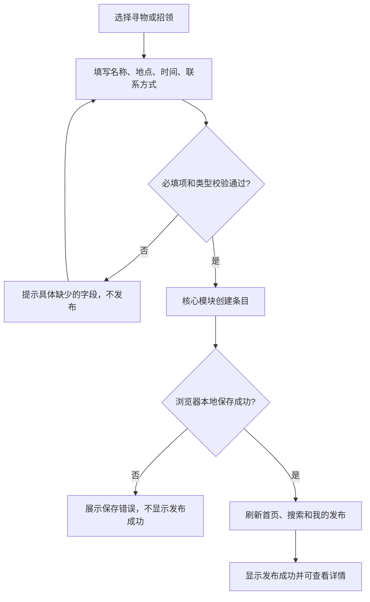
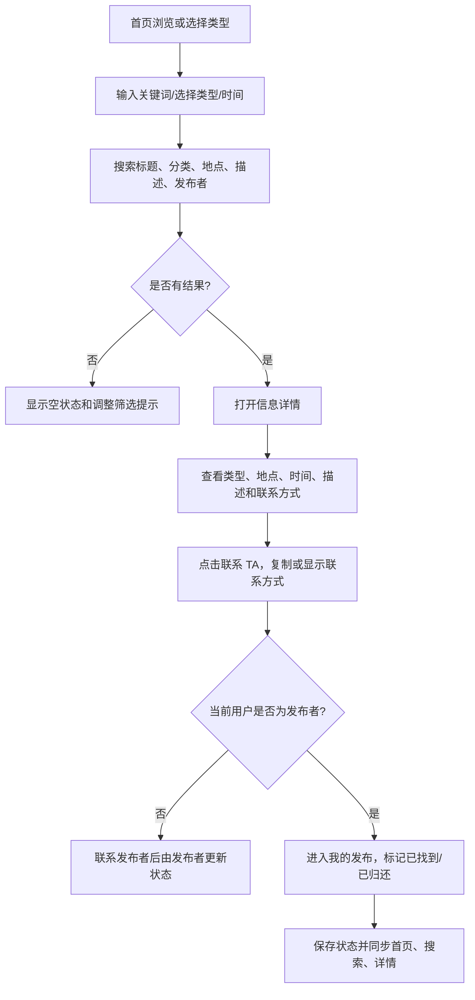
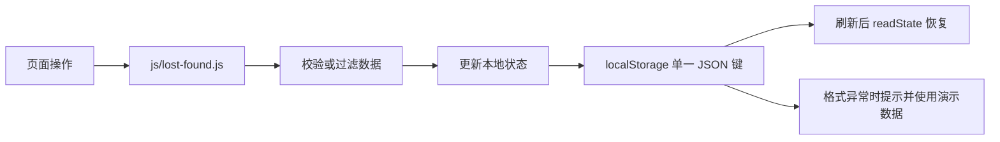

# 校园失物招领——第二次结对作业开发说明

> 本文说明本仓库中的浏览器端实现。博客地址、两位同学各自的实际分工、PSP 实际耗时、过程截图等需要由结对同学根据真实情况补充；本文不代填未经确认的信息。

## 1. 实现范围与设计

按第一次作业的产品流程，先完成“发布—浏览/搜索—详情—联系—状态维护”。使用原生 HTML、CSS 和 JavaScript，不引入服务端、账号系统、即时聊天或地图。示例数据帮助首次运行者立即浏览；新增内容、收藏和状态存在当前浏览器 `localStorage` 中。

### 数据模型

条目包含 `id`、`title`、`type`（`lost` / `found`）、`cat`、`place`、`time`、`desc`、`contact`、`user`、`status`（`open` / `done`）、`state`、`mine`、`createdAt` 展示字段等。状态文案根据类型生成：寻物从“寻找中”变为“已找到”，招领从“待认领”变为“已归还”。

核心函数集中在 `js/lost-found.js`：`validateItem` 校验必填项和类型，`createItem` 构造一条有效的新信息，`searchItems` 执行关键词、类型和日期筛选，`resolveItem` 维护解决状态，`readState` / `writeState` 读取和保存本地数据。页面控制器负责读写表单及刷新视图；核心模块不依赖 DOM，可由 Node.js 单独测试。

## 2. 主要流程图

### 发布与数据流



### 浏览、搜索、联系与状态维护



### 数据持久化



## 3. 关键代码

### 发布前校验与状态构造

```js
const errors = LostFound.validateItem(input);
if (errors.length) {
  toast(errors[0]);
  return;
}
const result = LostFound.createItem(ITEMS, input);
const nextItems = ITEMS.concat(result.item);
if (!persistState(nextItems, favorites)) return;
ITEMS.push(result.item);
```

表单校验与数据构造不依赖页面；只有保存成功后才更新内存数据并进入成功页，避免“页面提示成功但数据未写入”的假成功。

### 统一解决状态

```js
function resolveItem(item) {
  if (!item || item.status === 'done') return false;
  item.status = 'done';
  item.state = item.type === 'lost' ? '已找到' : '已归还';
  return true;
}
```

用同一函数处理两类信息；重复点击不会重复变更，状态文本与类型对应。

### 注入安全的渲染

页面在拼接用户可输入的标题、地点等 HTML 文本前调用 `escapeHTML`，详情字段用 `textContent` 写入。这样用户填写的标签字符会作为文本展示，而不会被浏览器当成 HTML 执行。

## 4. 附加特点

1. **本地持久化**：刷新后仍保留发布、收藏和状态；单一 JSON 键减少多份数据写入不一致的机会。
2. **联系信息一键复制**：有剪贴板权限时复制联系方式；权限不可用时直接显示，避免操作无反馈。
3. **搜索补充字段**：除物品名称外，还可搜索类别、地点、描述和发布者；支持寻物/招领及最近三天筛选。
4. **异常数据可见**：格式错误或保存失败会显示提示并写入控制台，不会静默覆盖成“成功”。

目前没有账号或后端，因此“我的发布”是当前浏览器本地数据，不是跨设备的真实用户隔离；不应将演示样例当成校园实时信息。

## 5. 单元测试

测试工具为 Node.js 自带的 `node:test` 和 `node:assert/strict`，不需要安装第三方依赖。运行：

```bash
node --test 单元测试/lost-found.test.js
```

共设计 **19 个测试用例**，覆盖：

| 测试主题 | 覆盖场景 |
| --- | --- |
| 表单校验 | 空表单、非对象输入、非法类型 |
| 创建信息 | 去除首尾空格、编号递增、默认状态、可选描述 |
| 搜索筛选 | 大小写无关关键词、描述命中、类型筛选、动态时间筛选及不限时间 |
| 状态更新 | 寻物已找到、招领已归还、重复标记、不存在的条目 |
| 本地存储 | 发布与收藏往返、损坏 JSON、重复编号、无效收藏引用 |

测试数据包括正常、空值、非法类型、边界状态及损坏存储，优先验证白盒分支：校验失败路径、未命中搜索路径可在界面手动走查，核心模块则测试关键输入输出。纯逻辑单元测试不代替 Chrome 页面端到端走查；提交前还应人工完成“发布—搜索—详情—联系—标记状态—刷新恢复”整条流程。

### 简易学习步骤

1. 先从 `node --test` 文档了解测试运行器和断言模块，无需安装 Mocha。
2. 写一个 `test` 描述单一行为，在回调中调用被测函数并用 `assert` 比较实际值与预期值。
3. 为成功输入、边界值和错误输入分别建测试，测试名说明具体行为。
4. 在项目根目录运行上述命令；失败时根据显示的测试名称和断言差异定位。
5. 修改实现后重跑测试，确保旧行为仍然正确。

## 6. PSP（开发前估计 / 开发后实际）

下面的估计按本次程序范围列出，**预估是计划值，不是实际耗时**。两位结对同学的实际耗时、分工和返工原因无法从代码仓库可靠推算，请各自按实际工作记录填写；不要为了让总数相等而倒填。

| PSP 阶段 | 预估（分钟） | 实际（分钟） |
| --- | ---: | ---: |
| 计划与范围确认 | 20 | 待成员据实填写 |
| 需求分析与边界确认 | 25 | 待成员据实填写 |
| 设计与数据结构 | 35 | 待成员据实填写 |
| 代码规范与实现方案 | 15 | 待成员据实填写 |
| 核心逻辑和持久化实现 | 100 | 待成员据实填写 |
| 页面交互与适配 | 100 | 待成员据实填写 |
| 代码复审与联调 | 35 | 待成员据实填写 |
| 单元测试与缺陷修复 | 50 | 待成员据实填写 |
| 使用文档与总结 | 45 | 待成员据实填写 |
| 合计 | **425** | **待据实求和** |

记录建议：开发前先保存估计列；开发过程中分别记开始/结束时间或每阶段实际分钟；完成后再填实际列和合计，说明明显超时、返工及下一次改进。博客开头还需自行补上双方博客、仓库链接和实际分工。
